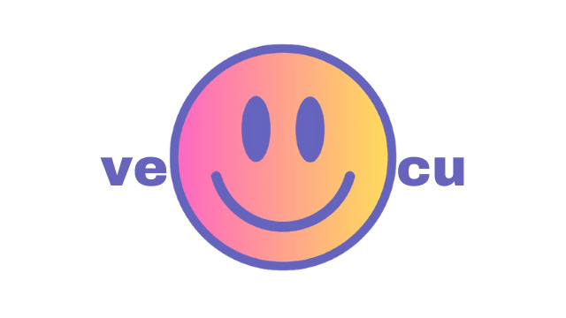
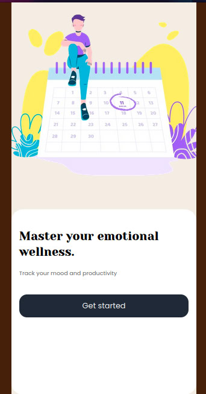
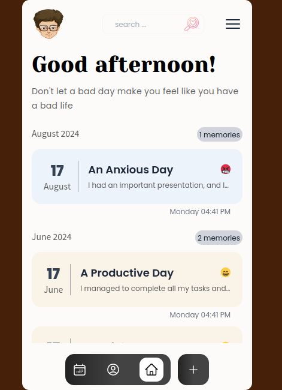
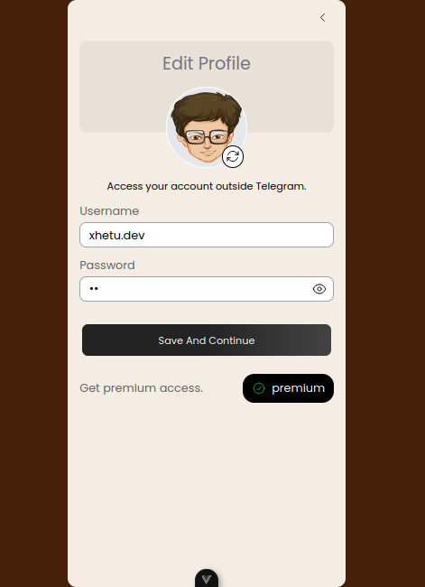
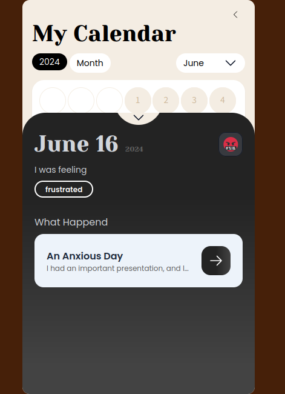
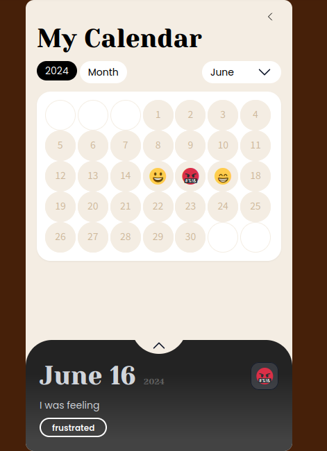

# Vecu

Vecu (from the French word "vécu") is a web application built with Vue.js, Supabase, and Tailwind CSS. Vecu allows you to save your daily diary, events, and moods. Additionally, you can analyze and view statistics of your productivity. 

## Features

- Save daily diary entries
- Track events and moods
- View detailed analysis and statistics of your productivity
- User-friendly interface with  intuitive screens

## Technologies Used

- **Vue.js**: The progressive JavaScript framework
- **Supabase**: The open-source Firebase alternative
- **Tailwind CSS**: A utility-first CSS framework

## Screenshots

Here are some screenshots of the Vecu web app:

### Start 

### Home 

### Profile 

### Calender 

### Calender 

## Getting Started

Follow these instructions to get a copy of the project up and running on your local machine.

### Prerequisites

Make sure you have the following installed:
- Node.js
- Vue CLI
- Supabase account

### Installation

